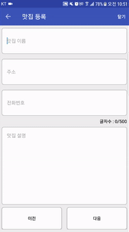
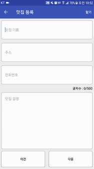

# 안드로이드 미니프로젝트 3

## 1. 개요
맛집 정보를 등록하고 구글 지도에 정보를 담은 마커를 보여주는 프로젝트  

 

  
  
   
  <b>[권한 설정 / 실행 화면]</b>

 

## 2. 설명
* 모든 맛집 정보를 입력하고 다음 버튼을 누르면 sqlite를 이용한 db에 정보가 저장된다.
* 정보가 저장될 때 intentService를 이용해 insert를 한다.
* 지도가 화면에 나타날 때 Background Thread를 통해서 Db에서 저장된 정보들을 읽어온다.
* 마커를 드래그해서 옮기면 그 지역의 주소 정보를 보여준다.

## 3. 사용 라이브러리
* https://github.com/JakeWharton/butterknife [ButterKnife]
* https://github.com/google/gson [Gson]
