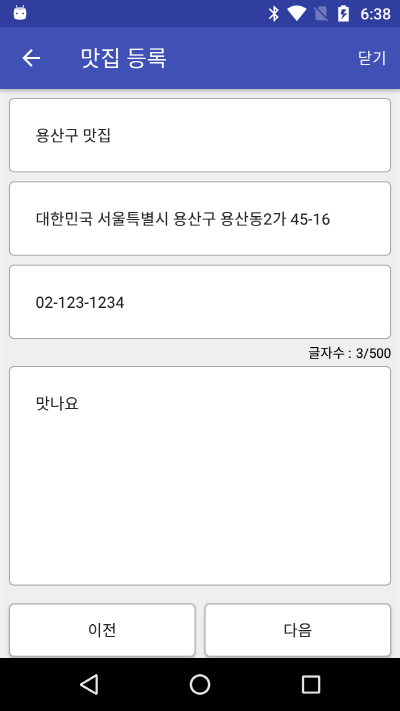
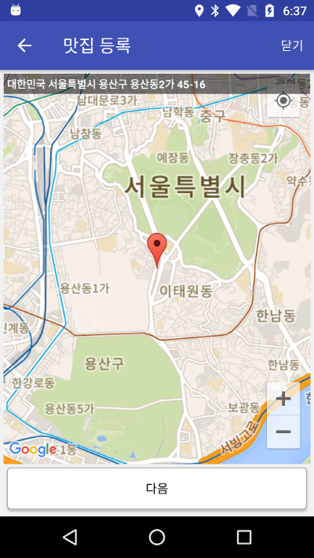

# 안드로이드 3주차 미니 프로젝트

## 1. 프로젝트 개요
맛집 정보를 등록할 수 있는 화면을 개발한다. 이를 통해 사용자에게 입력을 받고 위치 정보와 구글 맵을 활용하는 방법을 학습할 수 있다. 가장 먼저 사용자가 주소를 포함한 기본 정보를 입력하고 '다음' 버튼을 클릭하면 지도에 입력한 주소의 위치가 표시되고 상단에 해당 주소가 표시되게 한다.
 
## 2. 체크 포인트
* 화면을 동일하게 구성하였는가?
* 사용자에게 정보를 입력받는 화면, 지도를 표시하는 화면이 존재하는가?
* 사용자에게 맛집 이름, 주소, 전화번호, 맛집 설명을 입력받을 수 있는가?
* 입력받은 주소를 통해 지도 화면에서 해당 위치를 바로 표시해주고 있는가?
* 지도화면에서 마커를 이동해서 새로운 위치를 지정할 수 있는가?
* DB, SharedPreference, File 방식으로 정보를 저장하고 있는가?

## 3. 기본 화면 구성
 
